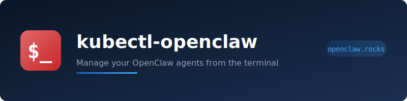

<p align="center">
  
</p>

<p align="center">
  <a href="https://opensource.org/licenses/Apache-2.0"></a>
  <a href="https://goreportcard.com/report/github.com/openclaw-rocks/kubectl-openclaw"></a>
  <a href="https://github.com/openclaw-rocks/kubectl-openclaw/actions/workflows/ci.yml"></a>
  <a href="https://kubernetes.io"></a>
  <a href="https://go.dev"></a>
</p>

<p align="center">
  <b>The kubectl plugin for the <a href="https://github.com/openclaw-rocks/k8s-operator">OpenClaw Kubernetes Operator</a>.</b><br>
  Full lifecycle management for your self-hosted AI agents — create, configure, debug, and operate — all from the terminal.
</p>

---

## Why

The [OpenClaw operator](https://github.com/openclaw-rocks/k8s-operator) manages `OpenClawInstance` custom resources on Kubernetes. This plugin gives you a purpose-built CLI so you never have to wrangle raw YAML to manage your agents.

Set an alias and it feels like a native tool:

```bash
alias claw="kubectl openclaw"
```

```
claw create my-agent --skills web-search --chromium
claw status my-agent
claw logs my-agent -f
claw skills add my-agent code-analysis
claw env set my-agent ANTHROPIC_API_KEY=sk-ant-...
claw enable my-agent ollama --models llama3
claw open my-agent
```

## Install

### Krew (recommended)

```bash
kubectl krew install openclaw
```

### Homebrew (coming soon)

```bash
brew install openclaw-rocks/tap/kubectl-openclaw
```

### Binary

Download from [Releases](https://github.com/openclaw-rocks/kubectl-openclaw/releases), extract, and place in your `$PATH`:

```bash
# macOS (Apple Silicon)
curl -L https://github.com/openclaw-rocks/kubectl-openclaw/releases/latest/download/kubectl-openclaw-darwin-arm64.tar.gz | tar xz
sudo mv kubectl-openclaw /usr/local/bin/

# macOS (Intel)
curl -L https://github.com/openclaw-rocks/kubectl-openclaw/releases/latest/download/kubectl-openclaw-darwin-amd64.tar.gz | tar xz
sudo mv kubectl-openclaw /usr/local/bin/

# Linux (amd64)
curl -L https://github.com/openclaw-rocks/kubectl-openclaw/releases/latest/download/kubectl-openclaw-linux-amd64.tar.gz | tar xz
sudo mv kubectl-openclaw /usr/local/bin/
```

### From source

```bash
go install github.com/openclaw-rocks/kubectl-openclaw@latest
```

## Quick start

```bash
# 1. Create an agent
claw create my-agent --skills web-search --chromium --python

# 2. Watch it come up
claw status my-agent
claw events my-agent

# 3. Set your API keys (via a Kubernetes Secret)
kubectl create secret generic my-keys --from-literal=ANTHROPIC_API_KEY=sk-ant-...
claw env add-secret my-agent my-keys

# 4. Access the UI
claw open my-agent
# or port-forward if no ingress:
claw port-forward my-agent

# 5. Shell in for debugging
claw exec my-agent

# 6. Tail the logs
claw logs my-agent -f
```

## Commands

### Lifecycle

| Command | Description |
|---------|-------------|
| `claw create NAME` | Create a new instance with flags for image, skills, sidecars, resources |
| `claw delete NAME` | Delete an instance (prompts for confirmation, backs up by default) |
| `claw restart NAME` | Restart by recycling pods (StatefulSet recreates them) |
| `claw upgrade NAME TAG` | Update the container image tag or digest |

### Inspection

| Command | Description |
|---------|-------------|
| `claw list` | List all instances with phase, readiness, and gateway endpoint |
| `claw status NAME` | Rich status: phase, endpoints, sidecars, conditions, pods, backup, auto-update |
| `claw logs NAME` | Stream logs with `-f`, `--tail`, `--since`, `--timestamps`, `-c CONTAINER` |
| `claw events NAME` | Kubernetes events for the instance, its pods, and StatefulSet |
| `claw config NAME` | View the effective `openclaw.json` from the managed ConfigMap |
| `claw config edit NAME` | Edit the inline config in `$EDITOR` and apply it |

### Interaction

| Command | Description |
|---------|-------------|
| `claw exec NAME` | Interactive shell (TTY) into the instance pod, or a specific sidecar |
| `claw port-forward NAME` | Forward gateway (18789) and canvas (18793) to localhost |
| `claw open NAME` | Open the canvas UI in your browser (detects ingress/LoadBalancer) |

### Configuration

| Command | Description |
|---------|-------------|
| `claw skills NAME` | List installed skills |
| `claw skills add NAME SKILL...` | Add ClawHub skills or `npm:` packages |
| `claw skills remove NAME SKILL...` | Remove skills |
| `claw env NAME` | List env vars and envFrom sources |
| `claw env set NAME KEY=VAL...` | Set environment variables |
| `claw env unset NAME KEY...` | Remove environment variables |
| `claw env add-secret NAME SECRET` | Mount a Secret as an environment source |
| `claw env remove-secret NAME SECRET` | Remove a Secret from environment sources |
| `claw enable NAME SIDECAR` | Enable a sidecar: `chromium`, `tailscale`, `ollama`, `web-terminal` |
| `claw disable NAME SIDECAR` | Disable a sidecar |

### Operations

| Command | Description |
|---------|-------------|
| `claw backup NAME` | Show backup schedule, last backup time/path, active jobs |
| `claw restore NAME PATH` | Trigger a restore from an S3 backup path |
| `claw doctor` | Cluster checks: CRD installed, operator running, webhooks configured |
| `claw doctor NAME` | Instance checks: phase, pod health, storage, all 14 condition types |

## Usage examples

### Create an agent with Ollama for local inference

```bash
claw create researcher \
  --skills web-search,summarize \
  --ollama --ollama-models llama3,codellama \
  --cpu 2 --memory 4Gi --storage 50Gi
```

### Enable Tailscale for mesh access

```bash
# Create the auth key secret first
kubectl create secret generic ts-key --from-literal=authkey=tskey-auth-...

# Enable Tailscale with Funnel for public access
claw enable my-agent tailscale --auth-secret ts-key --mode funnel --hostname my-agent
```

### Edit the agent's configuration interactively

```bash
claw config edit my-agent
# Opens $EDITOR with the openclaw.json — save and quit to apply
```

### Diagnose a failing instance

```bash
claw doctor my-agent
# === Cluster Checks ===
#   [PASS]  OpenClawInstance CRD installed
#   [PASS]  OpenClaw operator running
#   [PASS]  Webhooks configured
#
# === Instance Checks: my-agent ===
#   [PASS]  Instance "my-agent" exists
#   [FAIL]  Instance "my-agent" phase is Running
#           Current phase: Degraded
#   [PASS]  Pod for "my-agent" is healthy
#   [PASS]  Storage for "my-agent" is ready
#   [FAIL]  Condition SecretsReady
#           Secret "my-api-keys" not found

claw events my-agent
# LAST SEEN  TYPE     REASON          OBJECT                    MESSAGE
# 2m         Warning  SecretNotFound  OpenClawInstance/my-agent Secret "my-api-keys" not found
```

### Restore from a backup

```bash
# Check the last backup
claw backup my-agent
# Last Backup:
#   Path:  s3://my-bucket/openclaw/my-agent/2026-03-10T020000Z
#   Time:  2026-03-10T02:00:00Z (1d ago)

# Restore
claw restore my-agent s3://my-bucket/openclaw/my-agent/2026-03-10T020000Z

# Watch the restore
claw status my-agent
```

### Day-two operations

```bash
# Upgrade to a new release
claw upgrade my-agent v1.5.0

# Add a new capability
claw enable my-agent web-terminal

# Give it a new skill
claw skills add my-agent calendar-management

# Check resource usage and conditions
claw status my-agent

# Restart after config changes
claw restart my-agent
```

## Shell completion

```bash
# Bash
kubectl-openclaw completion bash > /etc/bash_completion.d/kubectl-openclaw

# Zsh
kubectl-openclaw completion zsh > "${fpath[1]}/_kubectl-openclaw"

# Fish
kubectl-openclaw completion fish > ~/.config/fish/completions/kubectl-openclaw.fish
```

## Requirements

- Kubernetes 1.28+
- [OpenClaw operator](https://github.com/openclaw-rocks/k8s-operator) installed in the cluster
- `kubectl` configured with cluster access

## Related

- [OpenClaw Operator](https://github.com/openclaw-rocks/k8s-operator) — the Kubernetes operator this plugin manages
- [OpenClaw](https://openclaw.ai) — the AI agent platform
- [openclaw.rocks](https://openclaw.rocks) — fully managed OpenClaw hosting

## Contributing

Contributions are welcome. Please open an issue to discuss significant changes before submitting a PR.

```bash
git clone https://github.com/openclaw-rocks/kubectl-openclaw.git
cd kubectl-openclaw
make build
make test
```

## License

Apache License 2.0 — see [LICENSE](LICENSE) for details.
